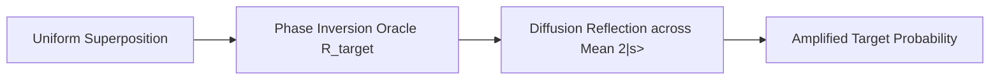

# Grover's Search & Amplitude Amplification Skill

High-efficiency, zero-dependency Python implementation of **Grover's Algorithm and Quantum Amplitude Amplification**.

## Features
- **Phase Inversion Oracle**: Flips the quantum phase \((-1)\) of marked target state.
- **Diffusion Operator Reflection**: Reflects statevector amplitudes across the mean to boost probability mass.
- **Quadratic Speedup**: Reaches near-certainty in \(\mathcal{O}(\sqrt{N})\) query steps.
- **Zero External Dependencies**: Pure Python standard library (`math`).
- **Native MCP Protocol**: JSON-RPC 2.0 stdio server compatible with Claude Desktop, Cursor, and Windsurf.

## Architecture

